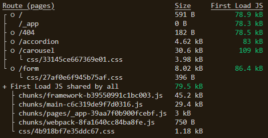
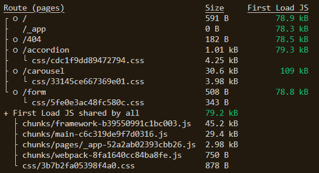

# Optimizing build performance in Next.js :writing_hand:

This is the code example for my article on [Optimizing build performance in Next.js](https://blog.logrocket.com) for [LogRocket](https://blog.logrocket.com).

Visit my blog, [Timonwa's Notes](https://blog.timonwa.com), for awesome technical content like articles, code snippets, tech goodies, community projects and more.

Please give this repo a ⭐ if it was helpful to you.

## Description

This demonstration shows how optimizing your Next.js app can improve your build performance. You can access the repo on [GitHub](https://github.com/Timonwa/optimising-nextjs-performance).

- The **main** branch is the optimized.
- The **unused-dependencies** branch has some unnecessary dependencies.
- In the **unnecessary-imports** branch, I imported unused css files into one of my pages.

By running `yarn build` on all branches, one could see a significant increase in the build size of the affected pages in the **main** branch.

_main branch build size_

In the `unused-dependencies` branch, I installed a few unnecessary dependencies like:

- react-icons (I only need 1 icon; using an SVG is better)
- react-accessible-accordion (Building a customized accordion is easy and smaller in size)
- react-hook-form (For a simple form, this package was overkill).

_unused-dependencies build size_

The `Form` and `Accordion` pages on the optimized branch were increased from _844b_ to _8.416kb_, and _1.37kb_ to _4.62kb_ respectively.

In the `unnecessary-imports` branch, I imported some CSS files into the `Accordion` page that I am not using. The accordion page size increased from _1.37kb_ to _5.26kb_.

_unnecessary-imports build size_

This demo only demonstrates a few ways to optimize your Next.js app. There are other ways to optimize your Next.js app. You can read the article on [LogRocket](https://blog.logrocket.com).
