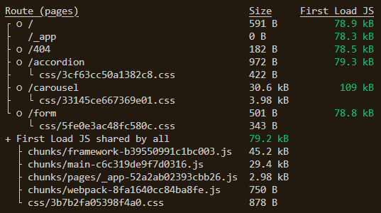

# Optimizing build performance in Next.js :writing_hand:

This is the code example for my article on [Optimizing build performance in Next.js](https://blog.logrocket.com) for [LogRocket](https://blog.logrocket.com).

Visit my blog, [Timonwa's Notes](https://blog.timonwa.com), for awesome technical content like articles, code snippets, tech goodies, community projects and more.

Please give this repo a ⭐ if it was helpful to you.

## Description

This demo is the code example for the article written by [Timonwa](https://blog.timonwa.co) for LogRocket on **Optimizing build performance in Next.js**. This demonstration shows how optimizing your Next.js app can improve your build performance. You can access the repo on [GitHub](https://github.com/Timonwa/optimising-nextjs-performance).

I did not focus on optimizing the build performance in the **main** branch. I installed a few unnecessary npm packages on this branch, and I wanted to show you how the build performance is by default.

I have the following packages installed:

- react-icons (I only used one icon from this package. I could have just used an SVG or UTF-8 character)
- react-accessible-accordion (Building my accordion would have been smaller in size)
- react-hook-form (My form was simple. I could have used the HTML form element)

I optimized the build performance in the **optimized** branch. I removed the unnecessary packages and built my accordion and form. I also used the UTF-8 character for the icon.

By running `yarn build` on both branches, one could see a big difference in the build size of the affected pages in the **optimized** branch. The **form** and **accordion** pages on the optimized branch were reduced significantly.

_Main branch build size_

_Optimized branch build size_

The form page went from _8.14kb_ to _614b_ and the accordion page went from _4.74kb_ to _1.09kb_.

This demo only demonstrates how using the right packages and building your components can improve your build performance. There are other ways to optimize your Next.js app. You can read the article on [LogRocket](https://blog.logrocket.com).

